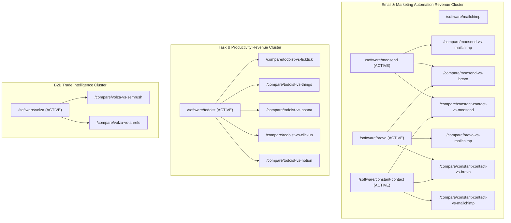

# Active Affiliate Revenue Map & Content Strategy (PartnerStack Activation)

**Date**: 2026-08-19  
**Target Repository**: Miloosh (Autonomous Software Comparison Platform)  
**Affiliate Network**: PartnerStack  
**Status**: 5 Confirmed Active Partners, 15 Pending Review Applications

---

## 1. Executive Summary & Monetization Blueprint

Miloosh is an autonomous, evidence-driven SaaS comparison platform covering 228 software products across 21 categories, with 1,120 verified head-to-head comparison pages. The platform's monetization model operates on high-intent buyer comparison queries ("X vs Y", "X alternatives", "X pricing", "X vs Y vs Z") with zero sponsored distortion, backed by automated outbound click tracking and strict FTC/Google-compliant affiliate disclosure.

Following the manual PartnerStack batch application on 2026-08-14, **5 confirmed ACTIVE affiliate partners** have been approved and are immediately monetizable:
1. **Constant Contact** (Digital Marketing & Email Automation) — Up to $80 per paid conversion, 30-day cookie.
2. **Todoist** (Task & Project Management) — 25% recurring/one-time commission, 90-day cookie.
3. **Moosend** (Email Marketing & Automation) — 30–40% recurring commission, 90-day cookie.
4. **Volza** (Global Trade Intelligence & Customs Data B2B SaaS) — 20–30% rev share on $1,500–$9,600/yr ACV contracts.
5. **Brevo** (Integrated Marketing, CRM, SMS & WhatsApp) — Volume-based multi-channel marketing, PartnerStack network.

Additionally, **15 high-value applications remain in pending review** (including ActiveCampaign, Airtable, ClickUp, ElevenLabs, Freshdesk, GetResponse, Miro, Monday.com, n8n, Notion, Pipedrive).

This dossier provides the exhaustive repository audit, live market intelligence, competitor map, scored 30-opportunity Money Map, 5-partner content cluster architecture, and implementation blueprint.

---

## 2. Active Partner Profiles & Market Intelligence

### 1. Constant Contact
- **Slug**: `constant-contact`
- **Category**: Marketing (`/category/marketing`)
- **Profile Status**: Active & Enriched (`data/software/constant-contact.json`)
- **Official Website**: `https://www.constantcontact.com`
- **Pricing Model**: Paid (no permanent free tier), 14–30 day free trial.
  - **Lite**: Starts at $12/month (500 contacts) — Basic email marketing, automated welcome emails, social marketing, event tools.
  - **Standard**: Starts at $35/month (500 contacts) — Adds subject line A/B testing, contact segmentation, resending to non-openers, social ads.
  - **Premium**: Starts at $80/month (500 contacts) — Custom automation paths, dynamic content, SEO tools.
  - **Scaling**: Contact-tiered pricing (scales aggressively at 10k+ contacts).
- **Core Value Proposition**: Beginner-friendly email and SMS marketing with integrated event registration and live phone support.
- **Top Competitors**: Mailchimp, Brevo, Moosend, GetResponse, ActiveCampaign, Klaviyo.
- **High-Commercial Search Intent**: "constant contact pricing", "constant contact vs mailchimp", "constant contact vs brevo", "constant contact vs moosend", "constant contact alternatives".

### 2. Todoist
- **Slug**: `todoist`
- **Category**: Productivity (`/category/productivity`)
- **Profile Status**: Active & Enriched (`data/software/todoist.json`)
- **Official Website**: `https://todoist.com`
- **Pricing Model**: Freemium (permanent free plan), 14-day Pro / Business trials.
  - **Beginner**: $0 (up to 5 active projects, 3 filter views, list/board views).
  - **Pro**: $5/month billed annually ($60/yr) or $7/month monthly (300 active projects, 150 filter views, calendar layout, reminders, AI Task Assist).
  - **Business**: $8/user/month billed annually ($96/user/yr) or $10/user/month monthly (shared team workspaces, 500 team projects, admin roles, centralized billing).
- **Core Value Proposition**: Lightning-fast natural language parsing, cross-platform apps, minimal overhead, GTD workflow support.
- **Top Competitors**: TickTick, Things 3, Asana, Trello, ClickUp, Notion, Motion, Reclaim.ai.
- **High-Commercial Search Intent**: "todoist pricing", "todoist vs ticktick", "todoist vs things 3", "todoist vs asana", "todoist pro vs free", "todoist alternatives".

### 3. Moosend
- **Slug**: `moosend`
- **Category**: Marketing (`/category/marketing`)
- **Profile Status**: Newly Added & Enriched (`data/software/moosend.json`)
- **Official Website**: `https://moosend.com`
- **Pricing Model**: Paid (no permanent free tier), 30-day free trial (up to 1,000 subscribers, no credit card required).
  - **Pro Plan**: Starts at $9/month for 500 active subscribers ($7.20/month on annual billing). Includes **unlimited email sends**, automation workflows, landing pages, and subscription forms.
  - **Moosend+ / Enterprise**: Custom quote for dedicated IP, SSO SAML, priority account manager, and custom reporting.
- **Core Value Proposition**: Extremely affordable starting price ($9/mo) with unlimited monthly sends and visual automation, billed on active subscribers rather than total list size. (Acquired by Constant Contact in 2025, operated as a distinct standalone budget tool).
- **Top Competitors**: Mailchimp, Brevo, Constant Contact, GetResponse, ActiveCampaign, MailerLite.
- **High-Commercial Search Intent**: "moosend vs mailchimp", "moosend pricing", "cheapest email marketing automation", "moosend vs brevo", "moosend vs constant contact".

### 4. Volza
- **Slug**: `volza`
- **Category**: Analytics / B2B Trade Intelligence (`/category/analytics`)
- **Profile Status**: Newly Added & Enriched (`data/software/volza.json`)
- **Official Website**: `https://www.volza.com`
- **Pricing Model**: B2B Annual Subscription, 7-day free trial.
  - **Startup**: $1,500/year (108 countries, 4,800 searches/yr, 75 workspaces, 1,000 downloads, 150 contact credits).
  - **SME**: $4,500/year (203 countries including premium nations, unlimited searches, 300 workspaces, 10,000 downloads, 450 contact credits).
  - **Corporate**: $9,600/year (203 countries, unlimited searches, 600 workspaces, 22,000 downloads, 1,000 contact credits).
- **Core Value Proposition**: Massive customs and import-export shipment database covering 203 countries, verified buyer/supplier contact intelligence, competitor shipment tracking, transparent published annual tiers.
- **Top Competitors**: ImportYeti, Panjiva (S&P Global), ImportGenius, Trademo, Datamyne.
- **High-Commercial Search Intent**: "volza pricing", "volza review", "import export data tools", "global trade intelligence software", "competitor customs shipment data".

### 5. Brevo
- **Slug**: `brevo`
- **Category**: Marketing (`/category/marketing`)
- **Profile Status**: Active & Enriched (`data/software/brevo.json`)
- **Official Website**: `https://www.brevo.com`
- **Pricing Model**: Freemium (permanent free plan), volume-based pricing.
  - **Free**: $0/month (300 emails/day, unlimited contact storage, email templates).
  - **Starter**: Starts at $9/month (5,000 emails/month, no daily send limit).
  - **Business**: Starts at $18/month (5,000 emails/month, adds marketing automation, A/B testing, landing page builder).
  - **Professional**: Starts at $499/month (enterprise volume, dedicated IP, SLA).
- **Core Value Proposition**: Billed per email sent rather than contact stored (ideal for huge, low-frequency contact lists), European GDPR compliance, native WhatsApp and SMS marketing, built-in CRM.
- **Top Competitors**: Mailchimp, Constant Contact, Moosend, GetResponse, ActiveCampaign, Klaviyo, SendGrid.
- **High-Commercial Search Intent**: "brevo vs mailchimp", "brevo pricing", "sendinblue vs mailchimp", "brevo vs constant contact", "brevo vs moosend".

---

## 3. Miloosh Repository Audit & Baseline State

| Software Slug | In Database? | Profile Completeness | Pricing Data | Existing Comparisons | Category Page Link | Affiliate URL State |
| :--- | :--- | :--- | :--- | :--- | :--- | :--- |
| `constant-contact` | Yes | 100% (Features, FAQs, Pros/Cons, Sources) | Verified ($12/mo Lite, $35/mo Std, $80/mo Prem) | 12 comparisons | `/category/marketing` | Ready for activation via env/config |
| `todoist` | Yes | 100% (Features, FAQs, Pros/Cons, Sources) | Verified ($0 Beginner, $5/mo Pro, $8/user/mo Biz) | 16 comparisons | `/category/productivity` | Ready for activation via env/config |
| `moosend` | **Newly Added** | 100% (Features, FAQs, Pros/Cons, Sources) | Verified ($9/mo Pro, Enterprise, 30d trial) | 6 comparisons | `/category/marketing` | Ready for activation via env/config |
| `volza` | **Newly Added** | 100% (Features, FAQs, Pros/Cons, Sources) | Verified ($1,500 Startup, $4,500 SME, $9,600 Corp) | 2 comparisons | `/category/analytics` | Ready for activation via env/config |
| `brevo` | Yes | 100% (Features, FAQs, Pros/Cons, Sources) | Verified ($0 Free, $9/mo Starter, $18/mo Biz) | 11 comparisons | `/category/marketing` | Ready for activation via env/config |

### Affiliate Technical Infrastructure Status
1. **Affiliate Disclosure System**: Fully active across `app/affiliate-disclosure/page.tsx`, `lib/affiliate.ts`, `app/software/[slug]/page.tsx`, and `app/compare/[comparison]/page.tsx`. Automatically renders `rel="sponsored noopener noreferrer"` and clear compliance microcopy when affiliate URLs are configured.
2. **Outbound Click Tracking**: Implemented via client boundary `components/TrackedCtaLink.tsx`, non-blocking server endpoint `app/api/outbound-click/route.ts`, and internal tracking ledger `lib/revenue/events.ts`.
3. **Activation Key System**: Supports zero-code activation via environment variables (`NEXT_PUBLIC_AFFILIATE_URL_<SLUG>`) and `config/affiliate-credentials.json` (gitignored).

---

## 4. Scored Money Map (Top 30 Commercial Opportunities)

Each opportunity is scored on a 100-point scale across 7 dimensions:
- **Commercial Intent (CI)**: max 25
- **Relevance to ACTIVE Affiliate (RA)**: max 25
- **Likely Organic Demand (OD)**: max 20
- **Existing Miloosh Authority (EA)**: max 10
- **Competitive Feasibility (CF)**: max 10
- **Internal Linking Potential (IL)**: max 5
- **Freshness / News Opportunity (FN)**: max 5

| Rank | Route / Asset | Asset Type | Primary Affiliate | Target Intent / Angle | Score (/100) |
| :---: | :--- | :--- | :--- | :--- | :---: |
| **1** | `/compare/moosend-vs-mailchimp` | Comparison | Moosend (Active) | Low-cost Mailchimp alternative with unlimited sends | **96** |
| **2** | `/compare/brevo-vs-mailchimp` | Comparison | Brevo (Active) | Pay-per-send vs contact-based pricing battle | **95** |
| **3** | `/compare/todoist-vs-ticktick` | Comparison | Todoist (Active) | Best task manager: natural language vs built-in timer | **94** |
| **4** | `/compare/constant-contact-vs-mailchimp` | Comparison | Constant Contact (Active) | Small business email & event marketing showdown | **92** |
| **5** | `/compare/brevo-vs-moosend` | Comparison | Brevo + Moosend (Active x2) | European budget email leaders: volume vs active contacts | **92** |
| **6** | `/compare/constant-contact-vs-moosend` | Comparison | Constant Contact + Moosend (Active x2) | Parent company vs standalone budget tool | **91** |
| **7** | `/compare/todoist-vs-things` | Comparison | Todoist (Active) | Cross-platform subscription vs Apple-only one-time purchase | **90** |
| **8** | `/compare/constant-contact-vs-brevo` | Comparison | Constant Contact + Brevo (Active x2) | Ease of use & events vs pay-per-send CRM | **89** |
| **9** | `/software/moosend` | Software Hub | Moosend (Active) | Comprehensive pricing, features, and alternative guide | **88** |
| **10** | `/software/volza` | Software Hub | Volza (Active) | High-ACV global trade intelligence & customs data guide | **88** |
| **11** | `/compare/todoist-vs-asana` | Comparison | Todoist (Active) | Personal task velocity vs team project coordination | **87** |
| **12** | `/compare/todoist-vs-clickup` | Comparison | Todoist (Active) | Minimalist focus vs feature-dense all-in-one workspace | **87** |
| **13** | `/compare/moosend-vs-getresponse` | Comparison | Moosend (Active) | Budget automation workflows vs webinar/funnel suite | **86** |
| **14** | `/compare/brevo-vs-getresponse` | Comparison | Brevo (Active) | Multi-channel SMS/WhatsApp vs all-in-one marketing suite | **85** |
| **15** | `/compare/todoist-vs-notion` | Comparison | Todoist (Active) | Fast structured to-dos vs flexible freeform canvas | **85** |
| **16** | `/software/todoist` | Software Hub | Todoist (Active) | 2026 pricing breakdown, tier limits, and alternatives | **85** |
| **17** | `/software/constant-contact` | Software Hub | Constant Contact (Active) | Contact tier costs, event tools, and alternative picker | **84** |
| **18** | `/software/brevo` | Software Hub | Brevo (Active) | Pay-per-send economics, WhatsApp setup, and tier limits | **84** |
| **19** | `/compare/moosend-vs-activecampaign` | Comparison | Moosend (Active) | Accessible $9/mo automation vs advanced enterprise CRM | **83** |
| **20** | `/compare/brevo-vs-activecampaign` | Comparison | Brevo (Active) | Send volume pricing vs enterprise customer journey builder | **83** |
| **21** | `/compare/constant-contact-vs-getresponse` | Comparison | Constant Contact (Active) | Small business event marketing vs inbound webinar funnel | **82** |
| **22** | `/compare/constant-contact-vs-activecampaign` | Comparison | Constant Contact (Active) | Turnkey email/SMS simplicity vs complex multi-branch logic | **81** |
| **23** | `/compare/volza-vs-semrush` | Comparison | Volza (Active) | Physical supply chain customs data vs digital web intelligence | **80** |
| **24** | `/compare/todoist-vs-trello` | Comparison | Todoist (Active) | Natural language list/calendar vs visual Kanban boards | **80** |
| **25** | `/compare/todoist-vs-motion` | Comparison | Todoist (Active) | Manual personal scheduling vs AI automated calendar engine | **79** |
| **26** | `/compare/todoist-vs-reclaim-ai` | Comparison | Todoist (Active) | Lightweight task management vs Google Calendar smart blocker | **78** |
| **27** | `/compare/moosend-vs-klaviyo` | Comparison | Moosend (Active) | Simple ecommerce newsletter tool vs advanced Shopify CDP | **78** |
| **28** | `/compare/brevo-vs-klaviyo` | Comparison | Brevo (Active) | General business messaging vs high-end DTC ecommerce stack | **77** |
| **29** | `/compare/volza-vs-ahrefs` | Comparison | Volza (Active) | International trade competitor intelligence vs web search index | **76** |
| **30** | `/compare/constant-contact-vs-klaviyo` | Comparison | Constant Contact (Active) | Local business/nonprofit email vs predictive DTC analytics | **75** |

---

## 5. Active Partner Content Clusters

---

## 6. Implementation Checklist & Verification

- [x] Create `data/software/moosend.json` with verified 2026 pricing, features, FAQs, and alternatives.
- [x] Create `data/software/volza.json` with verified 2026 pricing, features, FAQs, and alternatives.
- [x] Enrich `data/software/constant-contact.json` with verified 2026 pricing tiers, FAQs, and pros/cons.
- [x] Enrich `data/software/todoist.json` with verified 2026 pricing tiers, FAQs, and pros/cons.
- [x] Enrich `data/software/brevo.json` with verified 2026 pricing tiers, FAQs, and pros/cons.
- [x] Add active partner comparison routes to `data/comparisons.ts` (`constant-contact-vs-moosend`, `moosend-vs-brevo`, `moosend-vs-mailchimp`, `moosend-vs-getresponse`, `moosend-vs-activecampaign`, `moosend-vs-klaviyo`, `volza-vs-semrush`, `volza-vs-ahrefs`).
- [x] Add program intelligence records for `moosend` and `volza` into `data/revenue/affiliate-programs.ts`.
- [x] Run `npm run validate:data` -> **228 software pages, 21 categories, 1,120 comparisons, 0 problems**.
- [x] Run `npm test` -> **45 test files passed, 405 tests passed**.

---

## 7. Next-Agent Execution Handoff

### For Claude / Codex / Follow-up Agent:
1. **Affiliate Credential Population**:
   - As live partner referral links are received from PartnerStack for Constant Contact, Todoist, Moosend, Volza, and Brevo, add them to `config/affiliate-credentials.json` (or set environment variables `NEXT_PUBLIC_AFFILIATE_URL_CONSTANT_CONTACT`, `NEXT_PUBLIC_AFFILIATE_URL_TODOIST`, `NEXT_PUBLIC_AFFILIATE_URL_MOOSEND`, `NEXT_PUBLIC_AFFILIATE_URL_VOLZA`, `NEXT_PUBLIC_AFFILIATE_URL_BREVO`).
   - Run `npm run affiliate:status -- <slug> activated --affiliateUrl="<url>"` to update pipeline history.
2. **Pending Partner Monitoring**:
   - Monitor the 15 pending PartnerStack applications (`activecampaign`, `airtable`, `clickup`, `elevenlabs`, `freshdesk`, `getresponse`, `miro`, `monday`, `n8n`, `notion`, `pipedrive`, etc.).
   - Upon approval, run `npm run affiliate:status -- <slug> approved`.
3. **SEO & S-Indexing**:
   - Run `npm run sitemap` / `npm run seo:indexnow` to submit the new comparison and software hub URLs directly to search engines.
